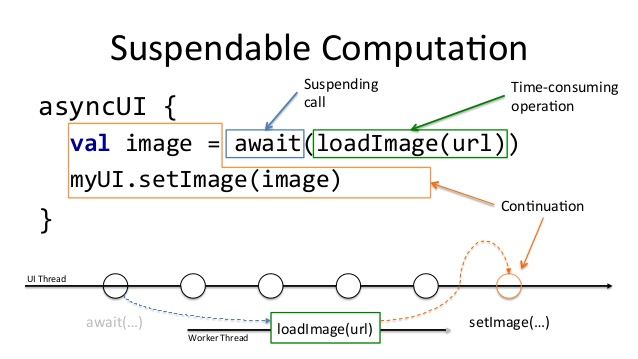
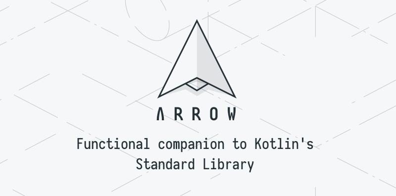

# Fav Quotes


**Fav Quotes** is a sample baseline project based a *Clean Architecture* implementation using some of the latest Android features.


## Installation
Clone this repository and import into **Android Studio**

##### Clone with SSH
```bash
> git clone git@github.com:pablodeafsapps/fav-quotes.git
```

##### Clone with HTTPS
```bash
> git clone https://github.com/pablodeafsapps/fav-quotes.git 
```

#### Prerequisites
In order to compile or execute the application, it is required to create a `keystore.properties` file at the project directory, with the following format:
```
storeFile = ""
storePassword = ""
keyAlias = ""
keyPassword = ""
```

This file can contain random or fake data when building as _debug_, but a real keystore is required to generate a signed APK.

Regarding the [FavQs API](https://favqs.com/api), a user key is required. For this particular sample app, a default key has been automatically configured. This sensitive information should be placed in a separate file, and excluded from any VCS scheme.

## Generating signed APK
From Android Studio:
1. ***Build*** menu
2. ***Generate Signed APK...***
3. Fill in the keystore information *(you only need to do this once manually and then let Android Studio remember it)*


## Architecture and project organization
To address this sample app development, the team has decided to employ a class hierarchy based on the [**Clean Architecture**](https://blog.cleancoder.com/uncle-bob/2012/08/13/the-clean-architecture.html) paradigm, a concept with an increasing popularity thanks to Robert C. Martin (Uncle Bob).


### Class hierarchy
Among the different implementations for Android applications of the aforementioned paradigm, there are remarkable contributions such as the ones from [Antonio Leiva](https://antonioleiva.com/clean-architecture-android/) and [Fernando Cejas](https://fernandocejas.com/2014/09/03/architecting-android-the-clean-way/). Precisely, this latter work has served as the main inspiration for this application architecture.


Therefore, the prior idea behind **Fav Quotes** is concern-layers separation. Each of this entities is in charge of certain responsibilities, which are handled in isolation. These layers get interconnected thanks through interfaces, which allow to achieve the necessary abstraction between them.

* **Presentation**
This layer's duties consist of managing the events caused by the user interactions, and rendering the information coming from the _domain_ layer. In this particular case, the team has opted for using the Model-View-ViewModel ([MVVM](https://proandroiddev.com/mvvm-architecture-viewmodel-and-livedata-part-1-604f50cda1)) architecture pattern. This entity "sees" the _domain_ layer.

* **Domain**
This layer is in charge of the application business logic. It is built upon _use-cases_ and repositories (_repository pattern_). The _domain_ layer obtains data from the _data_ module, use them to perform all the required operations, and format the outcomes to later deliver them to the _presentation_ layer. This entity only contains Kotlin code, and thus testing should only consist of **Unit Tests**. This layer represents the most inner entity, and thus it does not "see" anyone but itself.

* **Data**
This layer simply contains libraries and frameworks which provide data to the application (data sources). Among them, stand out service-query frameworks (_Retrofit_), local databases (_Room_), events tracking (_Omniture_), etc. This layer "sees" the _domain_ layer.

The usage of this class hierarchy and package organization pursues grasping the **SOLID** principles, getting more flexible when implementing new functionality, and easing code testing.
 
### Inversion of Control
In order to facilitate the interaction between the above described layers, **Fav Quotes** uses a dependency injector. **[Dagger](https://dagger.dev/)** is a popuular framework which allows to abstract type injection in a neat and clear manner. 

### Coroutines and Flow
Since _multithreading_ has historically been a challenge in Android Development, the team has decided to include [**Kotlin Coroutines**](https://kotlinlang.org/docs/coroutines-overview.html). This is one of the most interesting and appealing features available in Kotlin.



The main advantage that supports the usage of _coroutines_ is an easy and enhanced multithreading management. _Coroutines_  allow to turn asynchronous operations in synchronous code, without affecting the application overall performance.

From the _execution-flow_ perspective, every task is undertaken in the main thread (UI thread), until a _use-case_ is invoked. From that moment onwards, operations are handled in worker threads, to later retrieve the computed results in the main thread again.

Furthermore, this sample project makes use of the [**Flow API**](https://kotlinlang.org/docs/flow.html), which is a cold stream lightweight implementation. This feature is specifically used when successively loading available public quotes. The *ViewModel* gets subscribed to the _flow_, whereas the data source gets updated asynchronously.

### Functional Programming and Arrow

Functional Programming (FP) is a paradigm from the 1950s which is based upon the principals of declarative programming. It comprises certain prior foundations such as immutability, pure functions and no side effects/disciplined states, and referential transparency. Contrary to Object Oriented Programming (OOP), everything is meant to be a function (instead of an object). Bringing these concepts into an application allows to make it more flexible, understandable, and easily scalable.



[<b>Arrow</b>](https://arrow-kt.io/) is a functional programming suite written in Kotlin which aims to bring functional programming into Kotlin applications, such as Android ones. According to the [official documentation](https://arrow-kt.io/docs/core/), <i>"Arrow is a modular set of libraries that build on top of each other to provide increasingly higher level features"</i>.

The aim when building this app is improve it adding more functional features. So far, only the `Either` data type is used, allowing to parametrize any data source query available.

### Static Code Analysis with Detekt

[<b>Detekt</b>](https://github.com/detekt/detekt) is a static code analysis tool for the Kotlin programming language. It operates on the abstract syntax tree provided by the Kotlin compiler.

When integrated, it enables several Gradle tasks which allow to assess the code quality.

### Testing

As one main aspect in the current state-of-the-art in software development, **Fav Quotes** does include **Unit Tests**, which cover the *domain*, *presentation*, and *data* layers. In a more complex project, some *Integration Tests** would have been necessary to ensure a robust app performance.

It is recommended to advocate for an extensive usage of Unit Tests and Integration Tests. Instrumentation Tests are worth mentioning, since they cover testing on platform-dependent features, such as UI. None of these have been included here due to their slow execution and emulator/device dependency.

### Continuous Integration

Continuous Integration (CI) is the practice of automating the integration of code changes from multiple contributors into a single software project. The CI process is comprised of automatic tools that assert the new code's correctness before integration. A source code version control system is the crux of the CI process.


Among the many options available when it comes to CI, **Fav Quotes** uses [<b>GitHub Actions</b>](https://github.com/features/actions), which is a recent platform which is increasing popularity thanks to its straightforward integration when using GitHub. There are 2 different *workflows*, for *develop* and *feature* branches. 


## License 
This project is licensed under the MIT License - see the [LICENSE.md](LICENSE.md) file for details


## Documentation
The documentation is managed in two different ways:
* Using this **README.md** file to give a quick overview of the project.
* Using **dokka**, which is a framework for Kotlin projects, similar to Javadoc.

For the latter, the documentation can be find in the *docs/dokka* folder, organized in modules. To generate it, simply run the next command from a terminal:
```bash
> ./gradlew dokka
```  

When finished, open up `index.html` using your favourite browser.


## Maintainers
This project is mantained by:
* [Pablo L. Sordo Martínez](http://github.com/pablodeafsapps)


## Issues
If you happen to find any issue or suggestion, feel free to start a new thread on the _Issues_ section of the repository. I will try to address it as soon as possible.


## Contributing
1. Fork it
2. Create your feature branch (git checkout -b my-new-feature)
3. Commit your changes (git commit -m 'Add some feature')
4. Push your branch (git push origin my-new-feature)
5. Create a new Pull Request